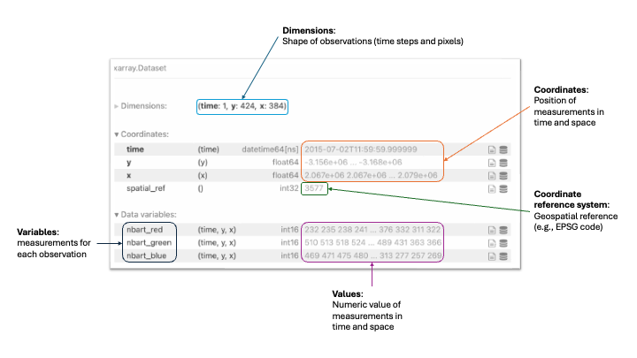
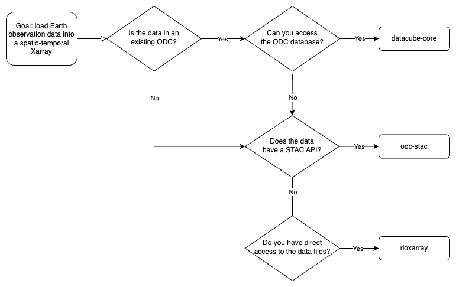

Accessing Data
==============

When working with Earth observation data, it must be read from the 
relevant file containing it and then stored in the computer's memory. 

The Open Data Cube (ODC) ecosystem represents Earth observation data as 
spatio-temporal arrays: the data are contextualised by spatial information 
indicating the location of pixels on Earth, and temporal information indicating 
when the observation was made.

The :abbr:`ODC (Open Data Cube)` 
ecosystem leverages the `Xarray`_ :term:`Python` package for implementing 
spatio-temporal arrays. An example Xarray from the 
:abbr:`ODC (Open Data Cube)` is shown in :numref:`odc-xarray-image`.

.. _odc-xarray-image:

   An Xarray is a labelled multi-dimensional array structure for :term:`Python`. 
   When used by the Open Data Cube, it contains information on the dimensions, 
   variables, values, coordinates, and the coordinate reference system, making it 
   a spatio-temporal array.

Depending on how the data is managed, there are different :abbr:`ODC (Open Data Cube)` ecosystem packages 
that can be used to open Earth observation data as a spatio-temporal Xarray:

* datacube-core_: accessing data from an existing Open Data Cube deployment
* odc-stac_: accessing data from an existing :abbr:`STAC (SpatioTemporal Asset Catalog)` :term:`API`
* rioxarray_: accessing data from data files

rioxarray_ is not managed by the maintainers of the :abbr:`ODC (Open Data Cube)` Ecosystem, but has been 
inspired by the :abbr:`ODC (Open Data Cube)` ecosystem. It provides a method to create labelled Xarrays similar 
to those produced within the :abbr:`ODC (Open Data Cube)` ecosystem.

The flowchart in :numref:`stac-or-core-image` may help you understand the best package 
for accessing data depending on how the data are managed.

.. _stac-or-core-image:

   There are three packages that can be used to access data as a labelled spatio-temporal Xarray depending
   on how the data are managed: datacube-core_, odc-stac_, and rioxarray_.

To read more about each package, see :doc:`extensions`.
To understand if there is an existing :abbr:`ODC (Open Data Cube)` deployment 
that covers your area of interest, see :doc:`existing-deployments`.

.. _datacube-core: https://github.com/opendatacube/datacube-core
.. _odc-stac: https://github.com/opendatacube/odc-stac
.. _rioxarray: https://corteva.github.io/rioxarray/stable/
.. _`Xarray`: https://docs.xarray.dev/en/stable/
